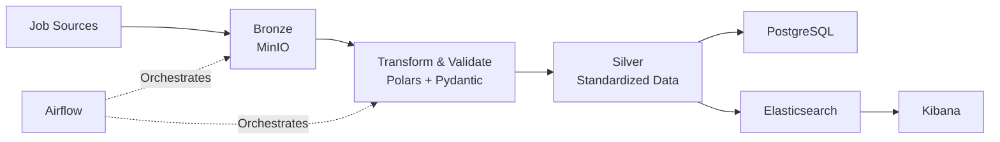

# JobLake Architecture

> Medallion Architecture (Bronze → Silver → Gold) for job data ingestion, standardization, validation, analytics, and search.

---

## Components

| Layer | Technology | Purpose |
|---------|---------|---------|
| Orchestration | Airflow | Schedule & monitor pipelines |
| Bronze | MinIO | Raw HTML / JSON storage |
| Silver | Polars + Pydantic | Standardize & validate data |
| Gold | PostgreSQL | Source of truth & analytics |
| Search | Elasticsearch | Full-text search |
| Visualization | Kibana | Dashboards & monitoring |

---

## Data Flow



---

## Data Layers

### Bronze

Raw immutable data.

Examples:

```text
linkedin/*.json
facebook/*.json
website/*.html
```

Purpose:

- Replay pipelines
- Debug parsing issues
- Preserve source data

---

### Silver

Standardized and validated records.

Example schema:

```yaml
job_id:
job_title:
company_name:
location:
salary_min:
salary_max:
source:
source_url:
posted_at:
```

Purpose:

- Data quality checks
- Schema normalization
- Reprocessing support

---

### Gold

Business-ready datasets.

#### PostgreSQL

Source of truth for:

- Analytics
- Reporting
- Application APIs

#### Elasticsearch

Optimized for:

- Full-text search
- Filtering
- Ranking

Can be rebuilt from PostgreSQL at any time.

---

## Data Quality

Validation rules:

- Required fields
- Type validation
- Salary consistency
- Duplicate detection
- Missing value monitoring

Failed records:

```text
Bronze
 └── rejected/
```

Metrics:

- job_count
- duplicate_rate
- missing_salary_rate
- validation_fail_rate

---

## Design Principles

- MinIO stores all raw data
- PostgreSQL is the source of truth
- Elasticsearch is a search index
- Airflow orchestrates, not transforms
- Every layer can be rebuilt from Bronze