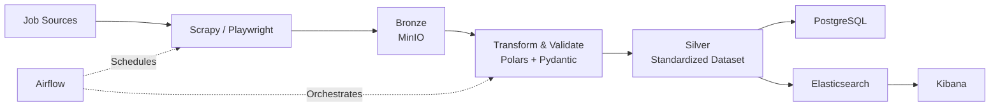

# JobLake Architecture

> Medallion Architecture (Bronze → Silver → Gold) for job data ingestion, validation, analytics, and search.

---

## Components

| Layer         | Technology          | Purpose                                        |
| ------------- | ------------------- | ---------------------------------------------- |
| Orchestration | Airflow             | Schedule, monitor, and retry pipelines         |
| Ingestion     | Scrapy + Playwright | Crawl job data from websites and dynamic pages |
| Bronze        | MinIO               | Raw HTML / JSON storage                        |
| Silver        | Polars + Pydantic   | Standardize, clean, and validate data          |
| Gold          | PostgreSQL          | Source of truth for analytics and applications |
| Search        | Elasticsearch       | Full-text search and filtering                 |
| Visualization | Kibana              | Monitoring and operational dashboards          |

---

## Data Flow



---

## Data Layers

### Bronze

Raw immutable source data.

Examples:

```text
linkedin/*.json
facebook/*.json
company_site/*.html
job_board/*.json
```

Purpose:

* Preserve original source data
* Replay pipelines
* Debug extraction issues
* Support future parser improvements

---

### Silver

Standardized and validated job records.

Example schema:

```yaml
job_id:
job_title:
company_name:
location:
salary_min:
salary_max:
currency:
employment_type:
source:
source_url:
posted_at:
scraped_at:
```

Purpose:

* Schema normalization
* Data quality enforcement
* Deduplication
* Reprocessing support

---

### Gold

Business-ready datasets.

#### PostgreSQL

Source of truth for:

* Analytics
* Reporting
* Internal APIs
* Downstream applications

Example use cases:

* Salary analysis
* Skill demand trends
* Hiring market insights

#### Elasticsearch

Optimized for:

* Full-text search
* Filtering
* Ranking

Notes:

* Elasticsearch is a serving layer
* Can be rebuilt from PostgreSQL at any time

---

## Data Quality

Validation rules:

* Required fields
* Type validation
* Salary consistency
* URL validation
* Duplicate detection
* Missing value monitoring

Failed records:

```text
bronze/
└── rejected/
```

Metrics:

```text
job_count
new_job_count
duplicate_rate
missing_salary_rate
validation_fail_rate
crawl_success_rate
```

---

## Design Principles

* Scrapy handles most crawling tasks
* Playwright is used only for JavaScript-heavy websites
* MinIO stores all raw data
* PostgreSQL is the source of truth
* Elasticsearch is a search index, not a database
* Airflow orchestrates, not transforms
* Every layer can be rebuilt from Bronze
* Pipelines should be idempotent and retryable

```
```
